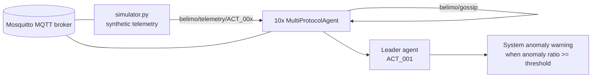

# StartHack: Swarm Intelligence with Decentralized Smart Actuators

Distributed anomaly detection demo for Smart Actuators using MQTT, and gossip-style coordination.

## What This Project Does

- Simulates <N> number of actuator/sensor nodes across multiple zones.
- Runs local anomaly detection for each agent.
- Uses peer heartbeats (gossip) to build swarm-level health awareness.
- Elevates system alerts when a configurable share of nodes are anomalous.

## Active Implementation

This workspace contains multiple snapshots and submissions. The current runnable stack documented here is:

- `agent/`

## Architecture



## Project Layout

- `agent/agent.py`: MultiProtocolAgent with local z-score reasoning and gossip logic.
- `agent/simulator.py`: Synthetic telemetry generator with local and cluster anomaly events.
- `agent/docker-compose.yml`: Full stack orchestration (broker + 10 agents + simulator).
- `agent/resample_anomaly_data.py`: Creates reproducible anomaly-labeled CSV data.
- `agent/mosquitto.conf`: MQTT broker config.

### Prerequisites

- Docker Desktop (or Docker Engine + Compose v2)

### Run

```bash
cd we-know-a-guy
docker-compose up --build --scale agent=n
```

```bash
cd we-know-a-guy
python -m pip install requirements.txt
python pi_dashboard_server.py
```

### Stop

```bash
docker compose down
```

### Gossip Topic

- `shared/protocol/gossip`

Payload fields include node identity, status, anomaly flag, value (e.g., torque), and timestamp.

## Detection Logic Summary

1. Compute rolling mean/std from recent baseline history.
2. Flag anomaly when $|z| >= STD_THRESHOLD$.
3. Keep baseline history representative of normal behavior by appending only non-anomalous values.

## Key Configuration

Configured in `agent/docker-compose.yml` via environment variables.

## Benefits

The stack demonstrates a pattern for building automation systems:

- protocol-agnostic normalization,
- decentralized local reasoning,
- lightweight swarm coordination,
- and scalable early-warning behavior without a centralized controller.